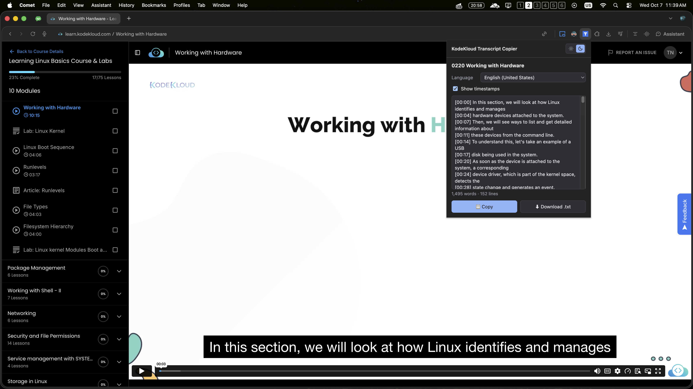

# KodeKloud Transcript Copier



A small Chrome extension (Manifest V3) that copies or downloads the transcript of a Vimeo video embedded on a web page, such as a lesson on [KodeKloud](https://learn.kodekloud.com). Click the extension icon and a popup shows the transcript.

Many course platforms embed Vimeo videos with captions but give you no way to read or copy them. This extension reads the caption tracks that the Vimeo player already exposes and turns them into plain text for note-taking and review.

## Features

- Works on any page that embeds a `player.vimeo.com` video.
- Pick the video (when a page has more than one) and the caption language.
- Two output modes:
  - **Paragraphs** (default): cues are joined into readable text, with duplicates removed.
  - **Timestamps**: one line per cue, formatted as `[mm:ss] text` (or `[hh:mm:ss]` for videos of an hour or longer).
- **Copy** to the clipboard or **download** as a `.txt` file named `<video title>.<lang>.txt`.
- No UI is injected into the page, so nothing can break the host site's layout.

## Install

The extension is not on the Chrome Web Store, so load it as an unpacked extension:

1. Download the latest `kodekloud-transcript-copier-*.zip` from the [Releases](../../releases) page and unzip it (or clone this repository).
2. Open `chrome://extensions` and turn on **Developer mode**.
3. Click **Load unpacked** and select the unzipped folder.
4. Open a page with a Vimeo video, then click the extension icon.

Requires Chrome 111 or newer, or another Chromium-based browser such as Edge or Brave.

After you change the code, click the reload button for the extension on `chrome://extensions`.

## How it works

```
Click extension icon
 └── popup.js
      ├── chrome.scripting.executeScript (world: MAIN, all frames)
      │     reads window.playerConfig inside each player.vimeo.com iframe
      ├── fetch(caption URL) from captions.vimeo.com
      └── parseVtt -> formatTranscript -> preview / copy / download
```

- The Vimeo player page blocks `fetch` to the caption host with its Content Security Policy, so the popup (an extension page with host permissions) downloads the `.vtt` file instead.
- Caption URLs are signed and expire. They are read fresh from the player every time the popup opens and are never cached.
- The popup only fetches URLs that start with `https://captions.vimeo.com/`.

### Permissions

| Permission | Why |
|---|---|
| `activeTab` | Lets the extension run a script in the current tab after you click the icon. |
| `scripting` | Needed for `chrome.scripting.executeScript`. |
| `https://player.vimeo.com/*` | Read the player config inside the embedded iframe. |
| `https://captions.vimeo.com/*` | Download the caption files. |

The extension does not collect or send any data anywhere other than Vimeo's own caption host.

## Project layout

```
manifest.json   Extension manifest
popup.html      Popup markup
popup.css       Popup styles
popup.js        Popup logic: find videos, fetch captions, copy, download
vtt.js          Pure helpers: parseVtt, formatTranscript, sanitizeFileName
vtt.test.js     Tests for vtt.js
icons/          Extension icons
SPEC.md         Design notes
```

`vtt.js` has no DOM or `chrome.*` dependencies, so it can be tested with Node.

## Development

No build step and no dependencies.

```sh
node --check popup.js vtt.js   # syntax check
node --test                    # run the tests (Node 18+)
```

## Troubleshooting

- **"No Vimeo video found on this page."**: the popup lists what it found in each frame below the message. `executeScript failed` means the extension could not access the tab; make sure you opened the popup by clicking the icon on that tab. A frame with `hasConfig:false` means the player did not expose `window.playerConfig`.
- **"Caption link expired."**: the signed caption URL has expired. Reload the page and open the popup again.
- **"This video has no captions."**: the video has no caption tracks.

## Limitations

- Only works for videos that have captions or subtitles. It does not generate transcripts.
- Depends on the structure of Vimeo's `window.playerConfig`, which Vimeo may change.

## Legal

Transcripts are usually copyrighted by the course or video owner. This tool is intended for **personal use**, such as study notes. Do not redistribute transcripts you do not have the rights to. Before publishing the extension to a store, review the terms of service of the sites and of Vimeo.

This project is not affiliated with or endorsed by Vimeo or KodeKloud.
